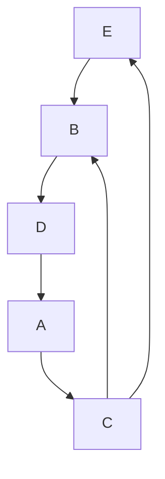
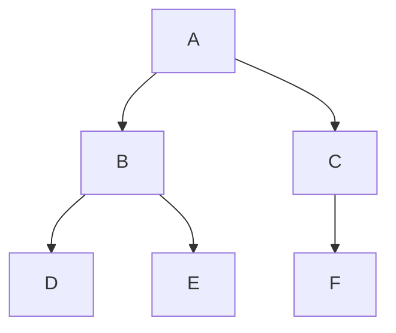

Vamos pensar no seguinte problema, como que conseguimos representar um sistema de rodovias no computador, cada rua vai estar ligada a outras ruas, a quantidade de ruas que uma rua ta ligada a outras não é fixa, então a partir disso como conseguimos estruturas nossos dados, o `Python` já nos da várias estruturas de dados padrões como as [[Lista|listas]], [[Dicionário|dicionários]] e [[Set|sets]], mas e para o nosso problema, como conseguimos trabalhar de uma forma clara, obviamente conseguimos usar listas, dicionários ou até conjuntos para conseguir fazer isso, mas fica claro? 




Este exemplo por exemplo, conseguimos representa-lo usando uma lista

```python
road = [
[2], # A(0) to C(2)
[3], # B(1) to D(3)
[1, 4], # C(2) to B(1), E(4)
[0], # D(3) to A(0)
[1], # E(4) to B(1)
]
```

Perceba que conseguimos criar a lista, mas imagina o trabalho que seria para trabalhar com isso, por causa disso conseguimos criar nossas próprias estruturas de dados para trabalhar com dados mais complexos.

## Pilha

Essa é uma estrutura de dados que parece com uma [[Lista|lista]], porém ela tem limitações impostas, conseguimos adicionar e tirar elementos, porém só conseguimos adicionar na última posição e tirar da última posição. Parece que é uma coisa ruim tirar funcionalidades, porém normalmente, tirando funcionalidades ganhamos em códigos mais rápidos, por exemplo, o `ctrl+Z` funciona usando essa estrutura, pois o único valor importante é o último, o usuário não precisa saber toda o `stack` de coisas que ele já digitou (pois é só ler), mas além disso essa é uma estrutura muito importante para o sistema operacional, e para linguagens de programação, como o próprio `Python`.
A sua implementação é simples em `python`, pois [[Lista|list]] já tem esses métodos, mas conseguimos implementar em [[Classes|classe]].

```python
class Stack:
	def __init__(self) -> None:
		self._itens = []
	
	def is_empty(self) -> bool:
		return not bool(self._itens)
	
	def push(self, item) -> None:
		self._itens.append(item)
		
	def pop(self):
		if self.is_empty():
			return None
		return self._itens.pop()
```

Obviamente é possível criar uma implementação sem usar listas, porém não será feito aqui

## Fila

Uma fila é parecida com uma [[#Pilha|pilha]], porém o primeiro a entrar é o primeiro a sair. Isso é usado para sistemas que tem uma fila de operações e essa ordem precisa ser mantida.

```python
class Queue:
	def __init__(self) -> None:
		self._itens = []
	
	def is_empty(self) -> bool:
		return not bool(self._itens)
	
	def enqueue(self, item) -> None:
		self._itens.append(item)
		
	def dequeue(self):
		if self.is_empty():
			return None
		first, *self._items = self._items
		return last
```

## Árvore

Essa é uma estrutura hierárquica que ordena cada nó e seus filhos, e existe um nó raiz. Essa estrutura é extremamente importante em várias locais, como por exemplo, sistemas de arquivos, árvores de decisão de inteligência artificial, compiladores, banco de dados, basicamente qualquer sistema que tenha uma estrutura hierárquica de dados



Aqui vamos implementar uma árvore binária, que é uma árvore com apenas dois nós filhos, mas existem implementações mais gerais que pode ter quantos quiser, a ordem de inserção dessa árvore será em relação a seu valor, que será um inteiro, se o inteiro for menor que o nó que está sendo analisado ele será adicionado a esquerda, se for maior ou igual à direita.

```python
class Node:
	def __init__(self, value: int) -> None:
		self.value = value
		self.left = None
		self.right = None
		
class Tree:
	def __init__(self) -> None:
		self.root = None
	
	def insert(self, value: int) -> None:
		self.root = self._insert(self.root, value)
		
	def _insert(self, node: Node, value: int) -> Node:
		if node is None:
			return Node(value)
		
		if value < node.value:
			node.left = self._insert(node.left, value)
		else:
			node.right = self._insert(node.right, value)
		return node

```

## Grafo

Grafo seria a melhor estrutura para trabalhar com o problema apresentado no começo desse texto sobre as ruas, ela é parecida com as árvores, mas sem a questão hierárquica, ela indica aonde cada vértice esta conectado

```python
class Graph:
    def __init__(self) -> None:
        self.adj = {}

    def add_vertices(self, v: str) -> None:
        if v not in self.adj:
            self.adj[v] = []

    def add_edges(self, v1, v2):
        self.adj.setdefault(v1, []).append(v2)
        self.adj.setdefault(v2, []).append(v1)

    def show(self):
        for v in self.adj:
            print(f"{v} -> {self.adj[v]}")
```

## Dataclass

Dataclass é uma estrutura do `python` que vem da [[Bibliotecas nativas|biblioteca]] `dataclasses`, ela facilita um processo que é a escrita dos atributos de uma [[Classes|classe]], normalmente escrevemos assim

```python
class MyClass:
	def __init__(self, arg1, arg2, arg3 = None):
		self.arg1 = arg1
		self.arg2 = arg2
		self.arg3 = arg3
```

Percebe que o processo de escrever esses argumentos é repetitivo e tedioso, então o `dataclass` é uma forma de estruturar os dados de forma mais fácil

```python
from dataclasses import dataclass 

@dataclass
class MyClass:
	arg1
	arg2 
	arg3 = None
```

Isso vai inicializar da mesma forma que a anterior sem precisar criar o [[Dunder#`__init__`|dunder __init__]], porém isso pode ser um problema, pois e se a gente precisar trabalhar em mais coisa na inicialização, como no caso abaixo, que foi tirado da documentação da biblioteca [dataclesses](https://docs.python.org/3/library/dataclasses.html)

```python
class Rectangle:
		def __init__(self, height: float, width: float) -> None:
			self.height = height
			self.width = width
		
		@property
		def area(self) -> float:
			return self.height * self.width
			

class Square(Rectangle):
	def __init__(self, side: float) -> None:
		self.side = side
		
		super().__init__(self.side, self.side)
```

Para trabalhar com esse caso por exemplo, usamos o [[Dunder#`__post_init__`|dunder __post_init__]], que realizará operações pós inicialização

```python
class Rectangle:
		def __init__(self, height: float, width: float) -> None:
			self.height = height
			self.width = width
		
		@property
		def area(self) -> float:
			return self.height * self.width
			
@dataclass
class Square(Rectangle):
	side: float
	
	def __post_init__(self) -> None:
		super().__init__(self.side, self.side)
```

Além disso recomendo uma leitura da documentação para o entendimento mais a fundo sobre esse [[Decorators|decorator]], o intuito disso é criar uma classe que representa um conjunto de dados.

## Enum

Essa estrutura consiste em relacionar nomes a valores, como por exemplo, se a gente tem uma empresa, e nessa empresa temos várias lojas e cada loja tem um código interno

```python
BRASILIA = '01'
SAO_PAULO = '02'
GOIANIA = '03'
```

A gente pode trabalhar dessa forma, comparando com o código, como por exemplo

```python
store = '02'

if store == '01'
	print('Brasilia')
elif store == '02'
	print('Sao Paulo')
elif store == '03'
	print('Goiania')

```

Porém existe uma estrutura para facilitar isso, que é a `enum` que é chamada pela [[Bibliotecas nativas|biblioteca]] `enum`

```python
from enum import Enum

class Store(Enum):
	BRASILIA = '01'
	SAO_PAULO = '02'
	GOIANIA = '03'
	
store = Store('02')
print(store)
print(store.name)
print(store.value)
```

Dessa forma temos uma relação direta entre o nome e a cidade, poderíamos também usar um dicionário

```python
stores = {
	'01': 'Brasilia',
	'02': 'Sao Paulo',
	'03': 'Goiania',
}

store_idx = '02'
store_name = stores[store_idx]
```

Porém, percebe que precisamos salvar duas variáveis para ter o mesmo efeito que o `Enum`, ele relaciona esses dois objetos de forma simples e fácil. Essa estrutura nos faz construir coisas como `bits` sem precisar usar nada da estrutura de números do `python`

```python
from enum import Enum

class Bit(Enum):
	ON = '1'
	OFF = '0'
	
	def __matmul__(self, otr: Bit) -> Bit: #nand operator (@ symbol)
		return {
            ('0', '0'): BitState.ON,
            ('0', '1'): BitState.ON,
            ('1', '0'): BitState.ON,
            ('1', '1'): BitState.OFF,
        }[(self.value, otr.value)]
        
    def __invert__(self) -> Bit: # invert a bit 
	    return self @ self
	    
	def __and__(self, otr: Bit) -> Bit: # and is a inverted nand
		return ~(self @ otr)
		
	def __or__(self, otr: Bit) -> Bit:
		return ~(~self & ~otr)
		
	def __xor__(self, otr: Bit) -> Bit:
		return (self | otr) & ~(self & otr)
		
	def __eq__(self, otr: Bit) -> bool:
		return {
			'1' : False,
			'0': True
		}[(~(self ^ otr)).value]

```

Essa implementação parece ser mais complexa que ela precisa, mas o intuito dela é minimizar a chance de cometer erros de escrita descrevendo as operações lógicas, além disso o intuito é somente mostrar que é possível construir objetos complexos baseados em uma ligação entre dois valores.