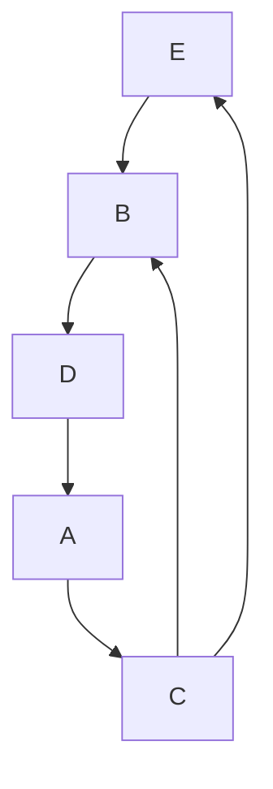
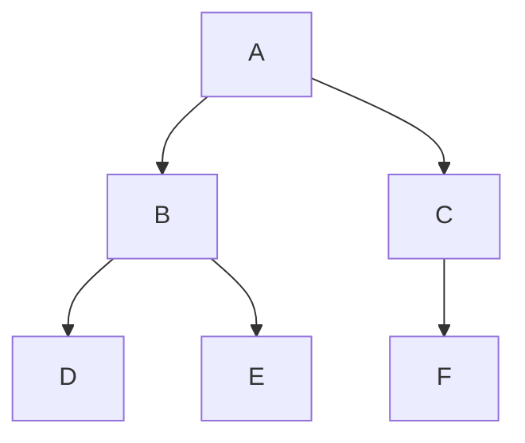

Vamos pensar no seguinte problema, como que conseguimos representar um sistema de rodovias no computador, cada rua vai estar ligada a outras ruas, a quantidade de ruas que uma rua ta ligada a outras não é fixa, então a partir disso como conseguimos estruturas nossos dados, o `Python` já nos da várias estruturas de dados padrões como as [[Lista|listas]], [[Dicionário|dicionários]] e [[Set|sets]], mas e para o nosso problema, como conseguimos trabalhar de uma forma clara, obviamente conseguimos usar listas, dicionários ou até conjuntos para conseguir fazer isso, mas fica claro? 




Este exemplo por exemplo, conseguimos representa-lo usando uma lista

```python
road = [
[2], # A(0) to C(2)
[3], # B(1) to D(3)
[1, 4], # C(2) to B(1), E(4)
[0], # D(3) to A(0)
[1], # E(4) to B(1)
]
```

Perceba que conseguimos criar a lista, mas imagina o trabalho que seria para trabalhar com isso, por causa disso conseguimos criar nossas próprias estruturas de dados para trabalhar com dados mais complexos.

## Pilha

Essa é uma estrutura de dados que parece com uma [[Lista|lista]], porém ela tem limitações impostas, conseguimos adicionar e tirar elementos, porém só conseguimos adicionar na última posição e tirar da última posição. Parece que é uma coisa ruim tirar funcionalidades, porém normalmente, tirando funcionalidades ganhamos em códigos mais rápidos, por exemplo, o `ctrl+Z` funciona usando essa estrutura, pois o único valor importante é o último, o usuário não precisa saber toda o `stack` de coisas que ele já digitou (pois é só ler), mas além disso essa é uma estrutura muito importante para o sistema operacional, e para linguagens de programação, como o próprio `Python`.
A sua implementação é simples em `python`, pois [[Lista|list]] já tem esses métodos, mas conseguimos implementar em [[Classes|classe]].

```python
class Stack:
	def __init__(self) -> None:
		self._itens = []
	
	def is_empty(self) -> bool:
		return not bool(self._itens)
	
	def push(self, item) -> None:
		self._itens.append(item)
		
	def pop(self):
		if self.is_empty():
			return None
		return self._itens.pop()
```

Obviamente é possível criar uma implementação sem usar listas, porém não será feito aqui

## Fila

Uma fila é parecida com uma [[#Pilha|pilha]], porém o primeiro a entrar é o primeiro a sair. Isso é usado para sistemas que tem uma fila de operações e essa ordem precisa ser mantida.

```python
class Queue:
	def __init__(self) -> None:
		self._itens = []
	
	def is_empty(self) -> bool:
		return not bool(self._itens)
	
	def enqueue(self, item) -> None:
		self._itens.append(item)
		
	def dequeue(self):
		if self.is_empty():
			return None
		first, *self._items = self._items
		return last
```

## Árvore

Essa é uma estrutura hierárquica que ordena cada nó e seus filhos, e existe um nó raiz. Essa estrutura é extremamente importante em várias locais, como por exemplo, sistemas de arquivos, árvores de decisão de inteligência artificial, compiladores, banco de dados, basicamente qualquer sistema que tenha uma estrutura hierárquica de dados



Aqui vamos implementar uma árvore binária, que é uma árvore com apenas dois nós filhos, mas existem implementações mais gerais que pode ter quantos quiser, a ordem de inserção dessa árvore será em relação a seu valor, que será um inteiro, se o inteiro for menor que o nó que está sendo analisado ele será adicionado a esquerda, se for maior ou igual à direita.

```python
class Node:
	def __init__(self, value: int) -> None:
		self.value = value
		self.left = None
		self.right = None
		
class Tree:
	def __init__(self) -> None:
		self.root = None
	
	def insert(self, value: int) -> None:
		self.root = self._insert(self.root, value)
		
	def _insert(self, node: Node, value: int) -> Node:
		if node is None:
			return Node(value)
		
		if value < node.value:
			node.left = self._insert(node.left, value)
		else:
			node.right = self._insert(node.right, value)
		return node

```

## Grafo

Grafo seria a melhor estrutura para trabalhar com o problema apresentado no começo desse texto sobre as ruas, ela é parecida com as árvores, mas sem a questão hierárquica, ela indica aonde cada vértice esta conectado

```python
class Graph:
    def __init__(self) -> None:
        self.adj = {}

    def add_vertices(self, v: str) -> None:
        if v not in self.adj:
            self.adj[v] = []

    def add_edges(self, v1, v2):
        self.adj.setdefault(v1, []).append(v2)
        self.adj.setdefault(v2, []).append(v1)

    def show(self):
        for v in self.adj:
            print(f"{v} -> {self.adj[v]}")
```

