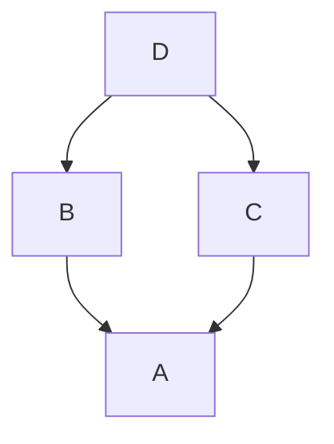
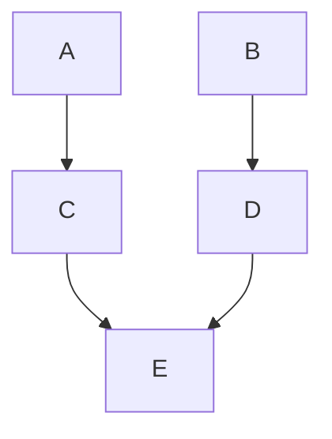

Agora vamos falar de conceitos essenciais de [[Classes|classe]], [herança e composição](https://realpython.com/inheritance-composition-python/) são dois conceitos bases para projetos maiores e abstratos, de uma forma simples, herança (Inheritance) é uma forma que uma classe herde da outra, por exemplo, no exemplo dado em [[Classes]], aonde a classe cachorro herda de animais, pois as funcionalidades de cachorro são, por parte, de animais de uma foram geral, dessa forma faz sentido ela herdar de animais. Já composição (Composition), seria atributos que são classes, por exemplo, um carro ele tem um motor que tem várias funcionalidades, mas o carro não herda do motor, pois não faz sentido, pois o carro tem motor, volante, pedal, etc...

## Herança

Herança, na prática estende as funcionalidades da classe pai, ou seja a classe filha pega todos os atributos, métodos e toda a estrutura da classe pai, mas ao mesmo tempo pode adicionar novas funcionalidades, modificar implementações que já existem e apagar métodos e atributos  (somente na classe filha).

```python
class Animal:
	def __init__(self, name, breed, age):
		self.name = name
		self.breed = breed
		self.age = age
		
		self._sound = None
	
	def speak(self):
		return f'The {self.__class__.__name__} {self.name} of age {self.age} and breed {self.breed} say {self._sound}'
		

class Dog(Animal):
	def __init__(self, name, breed, age):
		super().__init__(name, breed, age)
		
		self._sound = 'Woof'
```

Para fazer uma herança, de outra classe, a classe filha coloca como parâmetro da classe o nome da classe pai. Além disso, neste caso, usamos a palavra [[Funções Nativas#super|super]] para acessar o método `speak` do `Animal` para modificar o comportamento do `speak` do `Dog` ( polimorfismo), além disso o atributo `_sound` foi modificado também.

Isso é uma herança simples, existe formas de herdar de múltiplas classe

```python
class Worker:
    def __init__(self, title, salary):
        self.title = title
        self.salary = salary
    
    def work(self):
        return f"working with {self.title}"

class Student:
    def __init__(self, institution, course):
        self.institution = institution
        self.course = course
    
    def study(self):
        return f"Studying {self.course} in {self.institution}"

class Intern(Worker, Student): 
    def __init__(self, title, salary, institution, course, intern_hours):
        Worker.__init__(self, title, salary)
        Student.__init__(self, institution, course)
        self.intern_hours = intern_hours
    
    def report(self):
        return f"Intern: {self.title}, Course: {self.course}"
        
class Intern(Student, Worker):
	def __init__(self, institution, course, title, salary):
		pass
```

Neste caso estamos herdando de duas classes. Heranças múltiplas são algo que não é recomendado, pois pode gerar comportamentos inesperados, como por exemplo

```python
class D:
    def method(self):
        return "D"

class B(D):
    def method(self):
        return "B"

class C(D):
    def method(self):
        return "C"

class A(B, C):
    pass
    
print(A().method())
```

Neste caso, temos várias possibilidades de implementação do `method`, pois 



A classe `D`, herda de `B` e `C`, e essas herdam de `A`.  

## Method Resolution Order (MRO)

A forma que foi encontrada para solucionar esse problema é o `mro`, que define uma ordem para as classes que serão checadas para encontrar o método procurado, ela procura na primeira classe que foi herdado

```python
class D(B, C): # Check B first
	pass
```

Em seguida, vai depender, se `B` e `C` herdar da mesma classe, checará o `C`, e por último `A`, mas veja o seguinte exemplo

```python
class A:
	pass
	
class B:
	pass
	
class C(A):
	pass
	
class D(B):
	pass
	
class E(C, D):
	pass
	
print(E.__mro__)
```

Neste caso, como `C` e `D` herdam de classes diferentes checará 



Todos a árvore de herança da primeira classe, e em seguida toda a árvore de herança do seguinte termo. Acredito que tá obvio que é confuso isso, e é por causa disso existem soluções melhores ao invés de múltiplas heranças, elas devem ser evitadas com todas as forças.

## Composição

Composição é fazer uma classe ser um atributo de outra classe

```python
class Engine:
		def __init__(self, power):
			self.power = power
			
		def turn_on(self):
			return 'Engine turned on'
			
		def turn_off(self):
			return 'Engine turned off'
			
class SteeringWheel:
	def turn_left(self):
		return 'SteeringWheel turned left'
	
	def turn_right(self):
		return 'SteeringWheel turned right'
		
class Car:
	def __init__(self, power):
		self.engine = Engine(power)
		self.steering_wheel = SteeringWheel()
		
	def turn_on(self):
		return self.engine.turn_on()
		
	def turn_off(self):
		return self.engine.turn_off()
		
	def drive(self):
		return 'Driving car'
		
	def turn_left(self):
		return self.steering_wheel.turn_left()
		
	def turn_right(self):
		return self.steering_wheel.turn_right()
```

Este é um exemplo simples de composição, mas aqui vemos a importância de composição comparada com herança múltiplas, não tem todas as questões do `mro` e é fácil entender o que está acontecendo sem ter comportamentos esquisitos, como por exemplo, não é fácil usar herança para o seguinte caso de composição

```python
class A:
	def destroy(self):
		del self
		
class B:
	def destroy(self):
		del self
		
class C:
	def __init__(self):
		self.a = A()
		self.b = B()
		
	def destroy_a(self):
		self.a.destroy()
		
	def destroy_b(self):
		self.b.destroy()
```

Aqui é um exemplo extremo, mas vamos supor que temos duas classes que tem o mesmo método, mas com diferentes implementações, com a composições é fácil trabalhar. Além disso é possível introduzir mais de uma classe em uma mesma classe de forma simples

```python
class GasolineEngine(Engine):
	...
	
class EletricEngine(Engine):
	...
	
class Car:
	def __init__(self, engine_type):
		engine_dict ={
			'gasoline': GasolineEngine,
			'eletric': EletricEngine
		}
		
		if engine_type not in engine_dict:
			raise ValueError(f'Invalid engine type: {engine_type}')
			
		self.engine = engine_dict[engine_type]()
		

```
